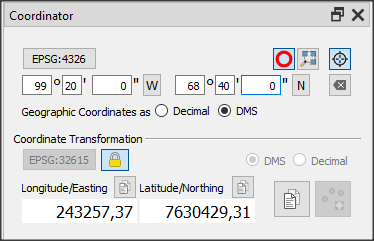
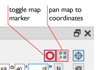
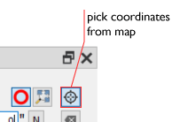
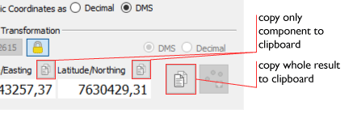
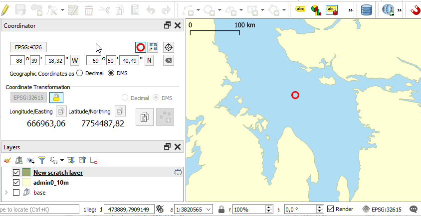

# Coordinator Plugin

Coordinator is a Python plugin for the popular FOSS GIS application [QGIS](https://qgis.org).

It's purpose of this plugin is to make handling of coordinate IO easier. It includes
a Coordinate Reference System (CRS) transformation tool and supports creation of
simple features. It may be useful for users working with spatial information
in different CRS and in need of a *quick* way to transform this data to fit with their
QGIS project.

This plugin overlaps in different ways with the purpose of the plugins Coordinate Capture,
Lat Lon Tools and the Advanced Digitize Panel. It however aims to integrate multiple tasks
these tools are sometimes used together in a clean and simple interface. And yes...:
It's almost as it's just another coordinate tool. :)

The two main functions of this plugin are:

1. a simple and easy to use coordinate transformation within the QGIS interface and
2. a quick to use coordinate digitizer with support for coordinates in an arbitrary
   CRS independent of project or layer CRS.

Both of these functions are seamlessly integrated and implemented as a single,
unique operation.

## Differences to similar Tools

It needs to be emphasized that this tool does not implement all the functionality of
mentioned plugins. These are probably better suited if more advanced tasks are performed.
Coordinator however may be still of support.

* Coordinator almost completely reproduces the functionality of the
  [**Coordinate Capture** Core plugin](https://docs.qgis.org/testing/en/docs/user_manual/plugins/plugins_coordinate_capture.html) while
  dropping the mouse tracking feature.
* For feature creation Coordinator is a complement to the
  [**Advanced Digitizing Panel**](https://docs.qgis.org/testing/en/docs/user_manual/working_with_vector/editing_geometry_attributes.html?highlight=advanced%20digitizing#the-advanced-digitizing-panel).
  If the coordinates
  to digitize are in another coordinate system than the layer to edit or are in a geographic
  coordinate system, Coordinator can directly digitize them &mdash; no need to transform
  these beforehand. Coordinator however does provide not the advanced construction methods
  Advanced Digitizing does.
* The plugin [**Lat Lon Tools**](https://plugins.qgis.org/plugins/latlontools/) provides a awesome way to
  handle coordinates and to digitize them. Because
  of its complex feature set, it spreads its functionality across multiple tools without
  interconnection. It also does not support digitizing lines or polygon features. Coordinator
  provides coordinate capture, transformation, editing, digitizing and clipboard export in a
  single interface.

## Usage

After [installing](https://docs.qgis.org/testing/en/docs/user_manual/plugins/plugins.html),
start the Coordinator panel by selecting **Plugins** / **Open Coordinator** in the QGIS menu.

### Basics

Coordinators basic function is to just transforms input coordinates into output
coordinates through a &mdash; you guessed it &mdash; coordinate transformation. The coordinator panel is structured
in two sections: The upper section represents the input, the lower the output of the
current coordinate transformation.

#### Transformation

The Input Coordinate Reference System (CRS) can be selected arbitrarily while
the Output CRS is connected with the currently active layer by default. If the user
selects another layer, the Output CRS changes accordingly. This behavior can be changed by toggling
the lock button in the lower section &mdash; if unlocked the output CRS can also be selected
independently from the active layer.

#### Input

There are two ways to enter new coordinates into the transformation:
1. by entering manually into the panel or
2. by capturing the coordinates with the picker from the map

Any input is transformed instantly.

Besides decimal coordinates both the input and the output support geographic coordinates
also in Degree/Minute/Seconds units (DMS) by selecting the appropriate option for the corresponding
section. If in DMS mode, buttons to switch the coordinate's hemisphere (North/South or East/West) become
active.

All the input can be cleared by pressing the corresponding button.

#### Map Visualization

The currently entered coordinate is marked on the main canvas with a circle. The marker can
be hidden by toggling the corresponding button. If the coordinate is currently not within
the current main canvas extent, a warning is shown.

By clicking the "Pan Map" button, the map is centered on the current coordinate. The
map's scale is not changed.

#### Coordinate Capture

The input coordinate can be captured from the map canvas with the picker tool activated with the corresponding
button. The input CRS does *not* have to be in the CRS of the map or currently active
layer.

#### Copy Result to Clipboard

The output of the transformation displayed in the lower section can be copied to the
clipboard as a whole with the button to the right. In this case both coordinate components
are separated by a tab for easy pasting into spreadsheet applications.

With the smaller copy buttons above the output coordinates components, only the respective
value is copied to clipboard.

#### Digitizing

Coordinator provides ways to create features based on the currently entered coordinates. The
corresponding button in the lower section is enabled when the user has a vector opened
for editing **and** is currently adding a feature **and** valid coordinates are entered
as input.

* For a layer with **Point Geometry** this means the "Add Point Feature"-Tool is enabled.
  Now, if the user clicks the "Add Coordinates"-Button, a new point feature is added
  to the layer. If attributes are to be entered for this new feature, the corresponding
  dialog is opened.
* For layers with **Line or Polygon Geometry**, the "Add Line/Polygon Feature"
  needs to be enabled. "Add Coordinates" adds the current coordinates to the
  current line or polygon rubberband or starts a new feature with the current coordinates
  as starting point. To actually create the new feature the user still has to finalize
  it &mdash; for example by right-clicking into the map.

Note that neither CRS of the transformation needs to be in the layer's CRS.

## Advanced Usage

### Stepwise Input change

All input fields support stepwise change by using the directional keys on the keyboard
or the mouse wheel. For example you can increment an input field by one by pressing
the "up"-arrow or by scrolling up while that field is active.

### Hemisphere switching

Pressing '-' (minus-key) in an input field switches the hemisphere of the coordinate
if the current input CRS is a geographic one.

### Keyboard Digitize

Pressing Enter/Return in any input field performs a coordinate digitization if currently
possible. It's therefore possible to digitize a bunch of coordinates manually, for example
when reading from unstructured coordinate lists.

## Known Issues / Limitations / Planned Features

* This plugin is not really tested for visuals on Linux desktops

* This plugin does not support more than two dimensions

* The plugin needs a way to handle pasting coordinates

* ctrl+c within panel should execute "copy whole result"

* Mouse tracking like Coordinate Capture
